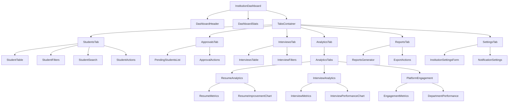
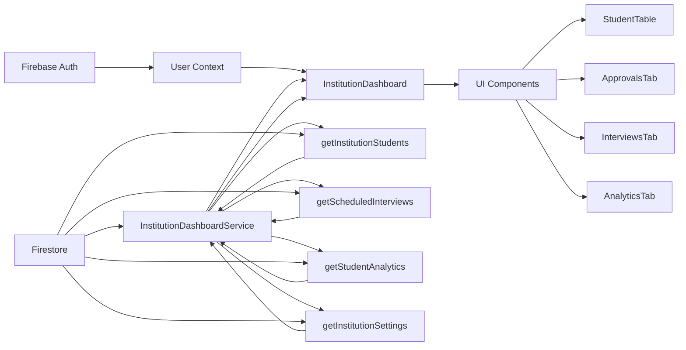
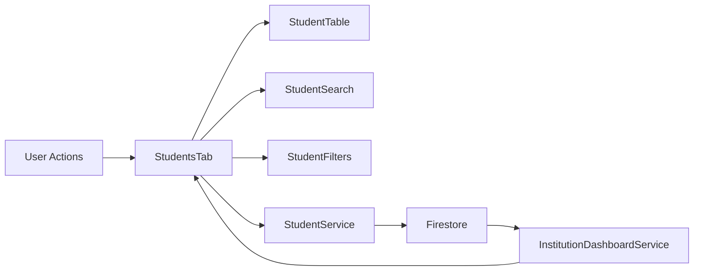
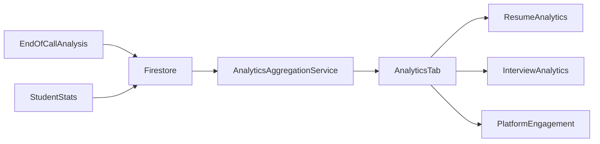

# Phase 2: Component Architecture

## 2.3 Create Component Architecture - Plan component structure and data flow

### 2.3.1 Design component hierarchy for InstitutionDashboard

#### Institution Dashboard Component Hierarchy



#### Component Breakdown

1. **InstitutionDashboard** (Root Component)
   - Purpose: Main container for the institution dashboard
   - Props: user: UserProfile
   - State: activeTab, institutionData, loading, error
   - Responsibilities:
     - Fetch and manage institution-level data
     - Handle tab switching
     - Manage loading and error states

2. **DashboardHeader**
   - Purpose: Display user context and greeting
   - Props: user: UserProfile
   - Responsibilities:
     - Show personalized greeting
     - Display user role and institution info

3. **DashboardStats**
   - Purpose: Show key institution metrics
   - Props: stats: InstitutionStats
   - State: loading, error
   - Responsibilities:
     - Display license usage
     - Show student counts by status
     - Display signup link information

4. **TabsContainer**
   - Purpose: Manage dashboard tabs
   - State: activeTab
   - Responsibilities:
     - Render appropriate tab content
     - Handle tab switching logic

5. **StudentsTab**
   - Purpose: Manage student listings
   - State: students, searchQuery, statusFilter, loading, error
   - Responsibilities:
     - Display student table
     - Handle student search and filtering
     - Manage student actions (view profile)

6. **StudentTable**
   - Purpose: Display student data in tabular format
   - Props: students: Student[], onAction: Function
   - Responsibilities:
     - Render student rows
     - Handle row actions
     - Support sorting and pagination

7. **StudentFilters**
   - Purpose: Provide filtering controls for students
   - State: statusFilter
   - Responsibilities:
     - Render status filter dropdown
     - Handle filter changes

8. **StudentSearch**
   - Purpose: Provide search functionality for students
   - State: searchQuery
   - Responsibilities:
     - Render search input
     - Handle search input changes

9. **ApprovalsTab**
   - Purpose: Manage pending student approvals
   - State: pendingStudents, loading, error
   - Responsibilities:
     - Display pending students list
     - Handle approval/rejection actions

10. **PendingStudentsList**
    - Purpose: Display list of pending students
    - Props: students: Student[], onApprove: Function, onReject: Function
    - Responsibilities:
      - Render pending student cards/items
      - Handle approval/rejection actions

11. **InterviewsTab**
    - Purpose: Display scheduled interviews
    - State: interviews, loading, error
    - Responsibilities:
      - Fetch and display scheduled interviews
      - Handle interview actions

12. **AnalyticsTab**
    - Purpose: Container for analytics components
    - State: activeAnalyticsTab
    - Responsibilities:
      - Manage analytics sub-tabs
      - Coordinate data flow between analytics components

13. **ResumeAnalytics**
    - Purpose: Display resume-related analytics
    - State: resumeData, loading, error
    - Responsibilities:
      - Fetch and display resume metrics
      - Render resume analytics visualizations

14. **InterviewAnalytics**
    - Purpose: Display interview-related analytics
    - State: interviewData, loading, error
    - Responsibilities:
      - Fetch and display interview metrics
      - Render interview analytics visualizations

15. **PlatformEngagement**
    - Purpose: Display platform engagement metrics
    - State: engagementData, loading, error
    - Responsibilities:
      - Fetch and display engagement metrics
      - Render engagement visualizations

16. **ReportsTab**
    - Purpose: Generate and export reports
    - State: reportData, loading, error
    - Responsibilities:
      - Fetch report data
      - Handle report generation and export

17. **SettingsTab**
    - Purpose: Manage institution settings
    - State: settings, loading, error
    - Responsibilities:
      - Display and edit institution settings
      - Handle settings save operations

### 2.3.2 Create data flow diagrams for major components

#### Data Flow for Institution Dashboard



#### Data Flow for Student Management



#### Data Flow for Analytics Dashboard



### 2.3.3 Plan state management strategy

#### State Management Approach

1. **Service-Level State Management**
   - Use React Context API for global state
   - Implement custom hooks for data fetching
   - Utilize React Query for server state management

2. **Component-Level State**
   - Use useState for local component state
   - Use useReducer for complex state logic
   - Implement proper state initialization and cleanup

3. **Global State Management**
   - Create InstitutionDashboardContext for dashboard-wide state
   - Manage loading, error, and data states globally
   - Share common data between components

#### Custom Hooks for Data Management

1. **useInstitutionData**
   ```typescript
   interface UseInstitutionDataReturn {
     students: UserProfile[];
     interviews: Interview[];
     analytics: any[];
     settings: InstitutionSettings;
     loading: boolean;
     error: string | null;
     refresh: () => void;
   }
   
   function useInstitutionData(institutionId: string): UseInstitutionDataReturn {
     // Implementation using React Query
   }
   ```

2. **useStudentManagement**
   ```typescript
   interface UseStudentManagementReturn {
     approveStudent: (studentId: string) => Promise<void>;
     rejectStudent: (studentId: string) => Promise<void>;
     searchStudents: (query: string) => Promise<UserProfile[]>;
     filterStudents: (status: string) => Promise<UserProfile[]>;
   }
   
   function useStudentManagement(institutionId: string): UseStudentManagementReturn {
     // Implementation using InstitutionDashboardService
   }
   ```

3. **useAnalyticsData**
   ```typescript
   interface UseAnalyticsDataReturn {
     resumeData: any[];
     interviewData: any[];
     engagementData: any;
     loading: boolean;
     error: string | null;
     refresh: () => void;
   }
   
   function useAnalyticsData(institutionId: string): UseAnalyticsDataReturn {
     // Implementation using AnalyticsAggregationService
   }
   ```

#### State Management Implementation Plan

1. **Context Providers**
   ```typescript
   // InstitutionDashboardContext.tsx
   interface InstitutionDashboardContextType {
     institutionId: string;
     user: UserProfile;
     students: UserProfile[];
     interviews: Interview[];
     analytics: any[];
     settings: InstitutionSettings;
     loading: boolean;
     error: string | null;
     refreshData: () => void;
   }
   
   const InstitutionDashboardContext = createContext<InstitutionDashboardContextType | undefined>(undefined);
   
   export const InstitutionDashboardProvider: React.FC<{ 
     institutionId: string; 
     user: UserProfile; 
     children: ReactNode 
   }> = ({ institutionId, user, children }) => {
     // State management implementation
   };
   ```

2. **State Update Patterns**
   - Optimistic updates for user actions
   - Background synchronization with server
   - Proper error handling and rollback mechanisms

3. **Performance Optimization**
   - Memoization of expensive computations
   - Lazy loading of non-critical data
   - Virtualization for large data sets

### 2.3.4 Identify reusable component patterns

#### Reusable UI Components

1. **DataTable Component**
   - Purpose: Generic table component for displaying tabular data
   - Features:
     - Sorting capabilities
     - Filtering support
     - Pagination
     - Row actions
     - Responsive design
   - Usage: StudentTable, InterviewsTable, Analytics tables

2. **Card Component**
   - Purpose: Consistent card layout for dashboard elements
   - Features:
     - Header with title and actions
     - Content area
     - Footer with additional actions
     - Loading and error states
   - Usage: DashboardStats, Analytics cards, Settings sections

3. **Filter Component**
   - Purpose: Reusable filtering controls
   - Features:
     - Multiple filter types (dropdown, text, date range)
     - Filter persistence
     - Clear filters functionality
   - Usage: StudentFilters, InterviewFilters, Analytics filters

4. **Search Component**
   - Purpose: Consistent search input with debouncing
   - Features:
     - Debounced search input
     - Clear search functionality
     - Search history (optional)
   - Usage: StudentSearch, InterviewSearch

5. **Modal Component**
   - Purpose: Standardized modal dialogs
   - Features:
     - Header with title and close button
     - Scrollable content area
     - Footer with action buttons
     - Keyboard navigation support
   - Usage: Student details, Settings edit, Report generation

6. **Chart Component**
   - Purpose: Wrapper for charting library
   - Features:
     - Multiple chart types (bar, line, pie)
     - Responsive sizing
     - Loading and error states
     - Tooltip support
   - Usage: Analytics visualizations, Performance charts

#### Reusable Business Logic Components

1. **DataFetcher Component**
   - Purpose: Abstract data fetching logic
   - Features:
     - Loading state management
     - Error handling
     - Retry mechanisms
     - Caching support
   - Usage: Wrap components that need data fetching

2. **PermissionGuard Component**
   - Purpose: Control access based on user permissions
   - Features:
     - Role-based access control
     - Permission checking
     - Fallback content for unauthorized access
   - Usage: Protect dashboard sections

3. **Notification Component**
   - Purpose: Standardized notification system
   - Features:
     - Toast notifications
     - Success, error, warning, info variants
     - Auto-dismissal
     - Action buttons
   - Usage: User feedback throughout dashboard

#### Component Composition Patterns

1. **Container-Presenter Pattern**
   - Separate data fetching (Container) from UI rendering (Presenter)
   - Containers handle business logic and state
   - Presenters focus on rendering and user interaction

2. **Higher-Order Components (HOCs)**
   - withLoading: Add loading state to components
   - withErrorBoundary: Add error handling to components
   - withAuthentication: Add authentication checks

3. **Render Props Pattern**
   - DataProvider: Provide data to child components
   - LoadingIndicator: Conditional rendering based on loading state

#### Component Reusability Matrix

| Component | Institution Dashboard | Teacher Dashboard | Student Dashboard | Admin Dashboard |
|-----------|----------------------|-------------------|-------------------|-----------------|
| DataTable | ✓ | ✓ | ✓ | ✓ |
| Card | ✓ | ✓ | ✓ | ✓ |
| Filter | ✓ | ✓ | ✗ | ✓ |
| Search | ✓ | ✓ | ✓ | ✓ |
| Modal | ✓ | ✓ | ✓ | ✓ |
| Chart | ✓ | ✓ | ✓ | ✓ |
| DataFetcher | ✓ | ✓ | ✓ | ✓ |
| PermissionGuard | ✓ | ✓ | ✓ | ✓ |
| Notification | ✓ | ✓ | ✓ | ✓ |

#### Component Library Structure

```
src/
├── components/
│   ├── ui/                 # Generic UI components
│   │   ├── DataTable/
│   │   ├── Card/
│   │   ├── Filter/
│   │   ├── Search/
│   │   ├── Modal/
│   │   ├── Chart/
│   │   └── Notification/
│   ├── dashboard/          # Dashboard-specific components
│   │   ├── InstitutionDashboard/
│   │   ├── TeacherDashboard/
│   │   ├── StudentDashboard/
│   │   └── AdminDashboard/
│   ├── shared/             # Shared business components
│   │   ├── DataFetcher/
│   │   ├── PermissionGuard/
│   │   └── ErrorBoundary/
│   └── common/             # Common utility components
│       ├── LoadingSpinner/
│       ├── ErrorMessage/
│       └── EmptyState/
```

This component architecture provides a scalable and maintainable structure for the Institution Dashboard while promoting code reuse and consistent user experience across all dashboards.